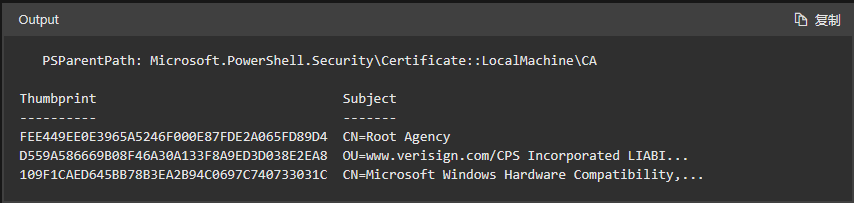

## PowerShell面面观 

&nbsp;<font size=2>PowerShell is the gold of the scripting world</font>

[官方文档](https://learn.microsoft.com/zh-cn/powershell/scripting)

**要点精髓**

> 1. PowerShell 的独特之处在于，它接受并返回 .NET 对象而非文本。
> 2. 管道的魅力


**常见指令**

> - Get-Verb 运行此命令时，将返回大多数命令遵循的谓词的列表。 响应包括有关这些谓词的功能的说明。 由于大多数命令都遵循这种命名约定，因此它对命令的功能设置了预期目标。 如果你要创建命令，这有助于选择适当的命令和命令名称。
> - Get-Command。 此命令会检索计算机上安装的所有命令的列表。
> - Get-Member。 它在基于对象的输出上运行，并且能够发现可用于命令的对象、属性和方法。
> - Get-Help。 以命令名称为参数调用此命令，将显示一个帮助页面，其中说明了命令的各个部分。

根据谓词进行筛选:

```
Get-Command -Verb 'Get'
```

根据名词进行筛选:

```
Get-Command -Noun U*
```

条件语句（c# linq):

```
Get-Command | Select-Object -First 5 -Property Name, Source

Get-Process | Where-Object {$_.ProcessName -like "p*"}
```

管道的魅力:

```
Get-Process | Get-Member
Get-Process | Get-Member -MemberType Method
Get-Process | Get-Member | Select-Object Name, Definition
Get-Command -ParameterType Process
```

策略：

```
Get-ExecutionPolicy
Set-ExecutionPolicy -ExecutionPolicy RemoteSigned
```

**管道or单行命令**

> - 单行命令：PowerShell 单行是一个连续管道，不一定是位于一个物理行上的命令。 并非一个物理行上的所有命令都是单行命令。即使以下命令位于多个物理行上，它也是 PowerShell 单行命令，因为它是一个连续管道。 它可以写在一个物理行上，但我已选择在管道符号处换行。 管道符号是 PowerShell 中允许自然换行处的某个字符。

```
Get-Service |
  Where-Object CanPauseAndContinue -eq $true |
    Select-Object -Property *
```
>  &nbsp; 自然换行可以出现在常用字符处，包括逗号 (,) 和方左括号 ([)、大括号 ({) 和圆括号 (()。 其他不太常见的字符包括分号 (;)、等于号 (=) 以及左单引号和双引号（'、"）。将反引号 (`) 或重音符用作续行符是一个有争议的话题。 建议尽量避免这样做。 我经常会看到使用反引号编写的 PowerShell 命令紧跟在自然换行符之后。 没有理由把它放在那里。

>  PowerShell ISE 的控制台窗格不会等待命令的其余部分在下一行（如 PowerShell 控制台）中输入。 要避免 PowerShell ISE 的控制台窗格中出现此问题，请使用 Shift+Enter，而不是只是在继续执行另一行上的命令时按 Enter。

> 许多编程和脚本语言要求在每一行的末尾使用分号。 尽管可以在 PowerShell 中以这种方法使用它们，但不建议这样做，因为它们不是必需的。

*一些练习命令*

```
ls -Path $env:TEMP
Get-Service -Name w32time | Get-Member
Get-Service -Name w32time | Stop-Service
'w32time' | Get-Member

$CustomObject = [pscustomobject]@{
 Name = 'w32time'
 }

 $CustomObject |
  Select-Object -Property @{name='Name';expression={$_.Service}} |
    Stop-Service

Stop-Service -DisplayName (Get-Content -Path $env:TEMP\services.txt)

Get-Alias
Get-Alias -Definition Get-Command, Get-Member

Get-PSProvider
Get-PSDrive
Import-Module -Name ActiveDirectory, SQLServer

```

```
Get-ChildItem -Path Cert:\LocalMachine\CA
```



运算符

操作员|	定义
---|---
-eq	|等于
-ne	|不等于
-gt	|大于
-ge	|大于或等于
-lt	|小于
-le	|小于或等于
-Like	|使用 * 通配符进行匹配
-NotLike	|不使用 * 通配符进行匹配
-Match	|匹配指定的正则表达式
-NotMatch	|不匹配指定的正则表达式
-Contains	|确定集合中是否包含指定的值
-NotContains	|确定集合是否不包含特定值
-In	|确定指定的值是否在集合中
-NotIn	|确定指定的值是否不在集合中
-Replace	|替换指定的值

[别名](Alias.md)

Windows 中的兼容性别名

PowerShell 具有多个别名，使 UNIX 和 cmd.exe 用户可以在 Windows 中使用熟悉的命令。 下表显示了常用命令、相关的 PowerShell cmdlet 和 PowerShell 别名：

cmd.exe命令|	UNIX 命令	|PowerShell Cmdlet	|PowerShell 别名
---|---|---|---
cd、chdir|	cd	|Set-Location	|sl、cd、chdir
cls	|clear	|Clear-Host	|cls clear
copy|	cp|	Copy-Item	|cpi、cp、copy
del、erase、rd、rmdir|	rm|	Remove-Item	|ri、del、erase、rd、rm、rmdir
dir	|ls|	Get-ChildItem	|gci、dir、ls
echo|	echo|	Write-Output|	write echo
md|	mkdir	|New-Item	|ni
move|	mv|	Move-Item	|mi、move、mi
popd|	popd|	Pop-Location	|popd
||pwd	|Get-Location	|gl、pwd
pushd	|pushd	|Push-Location|	pushd
ren	|mv	|Rename-Item	|rni、ren
type|	cat|	Get-Content	|gc、cat、type


## 基础知识

### 1. Array数组

```
$data=@()
$data01=@(1,2,3,4)
$data02=@('Cp1','Cp2','Cp3')
$data03=1,2,3

PS> $data = 'Zero','One','Two','Three'
PS> $data[0]
Zero

PS> $data[0,2,3]
Zero
Two
Three

PS> $data[1..3]
One
Two
Three

PS> $data[3..1]
Three
Two
One

PS> $data[-1]
Three

PS> $a = 1,2,3,4,5,6,7,8
PS> $a[2..-1]
3
2
1
8

PS> $data[ $data.count - 1 ]
Three

PS> $data.GetUpperBound(0)
3
PS> $data[ $data.GetUpperBound(0) ]
Three
```

**更新**

```
$data[2] = 'dos'
$data[3] = 'tres'
```

**迭代**

数组和 PowerShell 管道是相互适用的。 这是处理这些值最简单的方法之一。 将数组传递给管道时，数组中的每个项将得到单独处理

```
PS> $array=1,2,3,4,5,6
PS> $array |% {$_}
1
2
3
4
5
6

PS> $array |%{ "item:[$PsItem]"}
item:[1]
item:[2]
item:[3]
item:[4]
item:[5]
item:[6]
```

***ForEach foreach For***

PowerShell 允许你对集合调用 .ForEach()。

```
PS> $data.foreach({"Item [$PSItem]"})
Item [Zero]
Item [One]
Item [Two]
Item [Three]

$data.foreach{"Item [$PSItem]"}

for ( $index = 0; $index -lt $data.count; $index++)
{
    "Item: [{0}]" -f $data[$index]
}

PS> for($i=0;$i -lt $array.Count;$i++){
>> $array[$i]
>> }
1
2
3
4
5
6

for ( $index = 0; $index -lt $data.count; $index++ )
{
    $data[$index] = "Item: [{0}]" -f $data[$index]
}
```

***对象数组***

```
PS> $data = @(
>>     [pscustomobject]@{FirstName='Kevin';LastName='Marquette'}
>>     [pscustomobject]@{FirstName='John'; LastName='Doe'}
>> )

PS D:\Desktop\PoweshellOfScatteredBeans> $data.Count
2

PS D:\Desktop\PoweshellOfScatteredBeans> $data[0].LastName
Marquette

PS> $data | ForEach-Object {$_.LastName}
Marquette
Doe

PS> $data | Where-Object {$_.FirstName -eq 'Kevin'}
FirstName LastName
-----     ----
Kevin     Marquette


$data | Where FirstName -eq Kevin

```

***运算符***

**-join**

```
PS> $data = @(1,2,3,4)
PS> $data -join '-'
1-2-3-4
PS> $data -join ','
1,2,3,4

```

**-join $array**

***<font size=7>[妙招]</font>*** 如果你希望无需分隔符即可联接所有内容，请不要这样做：

```
PS> $data = @(1,2,3,4)
PS> $data -join $null
1234
```
可以将数组作为不带前缀的参数与 -join 一起使用。 具体请看下面的示例。

```
PS> $data = @(1,2,3,4)
PS> -join $data
1234
```

**-replace 和 -split**

```
PS> $data = @('ATX-SQL-01','ATX-SQL-02','ATX-SQL-03')
PS> $data -replace 'ATX','LAX'
LAX-SQL-01
LAX-SQL-02
LAX-SQL-03
```

**-contains**
```
PS> $data = @('red','green','blue')
PS> $data -contains 'green'
True
```

***<font size=6>-in</font>***
```
PS> $data = @('red','green','blue')
PS> 'green' -in $data
True
```

***<font size=6>-eq 和 -ne</font>***

```
PS> $data = @('red','green','blue')
PS> $data -eq 'green'
green

PS> $data = @('red','green','blue')
PS> $data -ne 'green'
red
blue
```

在 if() 语句中使用此运算符时，返回的值为 True 值。 如果未返回任何值，则它是 False 值。 下面这两个语句的计算结果都是 True

```
$data = @('red','green','blue')
if ( $data -eq 'green' )
{
    'Green was found'
}
if ( $data -ne 'green' )
{
    'And green was not found'
}
```

***<font size=6>$null 或空</font>***

测试 $null 或空数组可能比较棘手。 下面是一些常见的数组陷阱。

这个语句乍一看似乎可行。

```
if ( $array -eq $null)
{
    'Array is $null'
}
```
但我刚刚讲了 -eq 如何检查数组中的每一项。 因此，我们可以有一个由几个项组成的数组，其中只有一个 $null 值，它的值将为 $true

```
$array = @('one',$null,'three')
if ( $array -eq $null)
{
    'I think Array is $null, but I would be wrong'
}
```

这就是最好将 $null 放置在运算符左侧的原因。 这样此方案将不会出现任何问题。
```
if ( $null -eq $array )
{
    'Array actually is $null'
}
```
$null 数组与空数组不同。 如果知道有一个数组，请检查其中对象的计数。 如果数组为 $null，则计数为 0。
```
if ( $array.count -gt 0 )
{
    "Array isn't empty"
}
```
还有一个陷阱需要注意。 即使有单个对象，也可以使用 count，除非该对象是 PSCustomObject。 这是在 PowerShell 6.1 中修复的 bug。 这是个不错的消息，但有很多人仍在使用 5.1，因此需要注意。
```
PS> $object = [PSCustomObject]@{Name='TestObject'}
PS> $object.count
$null
```
如果仍在使用 PowerShell 5.1，则可以在检查计数之前将对象包装在数组中，以获取准确的计数。
```
if ( @($array).count -gt 0 )
{
    "Array isn't empty"
}
```
稳妥起见，请检查是否有 $null，然后再检查计数。
```
if ( $null -ne $array -and @($array).count -gt 0 )
{
    "Array isn't empty"
}
```

***待续。。。***


### 2. 哈希表